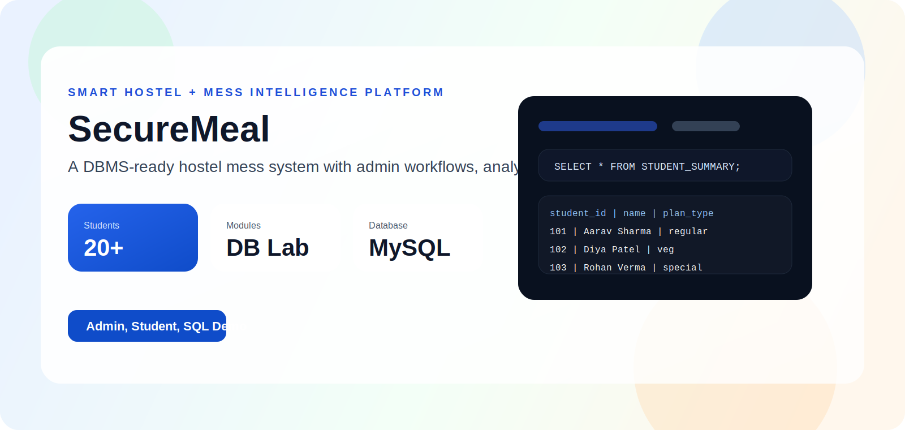
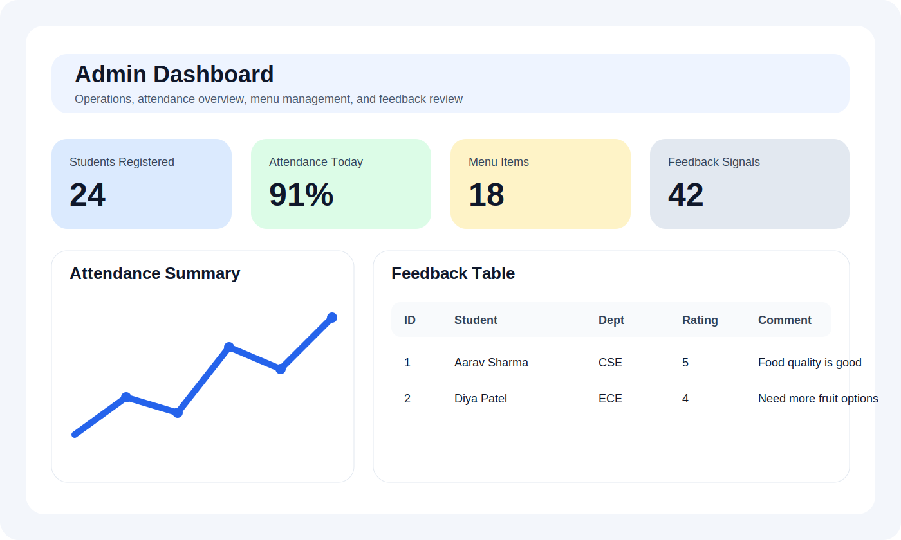
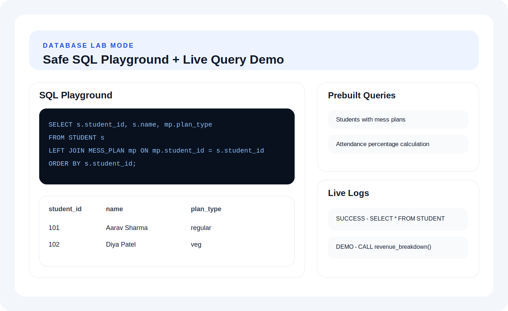
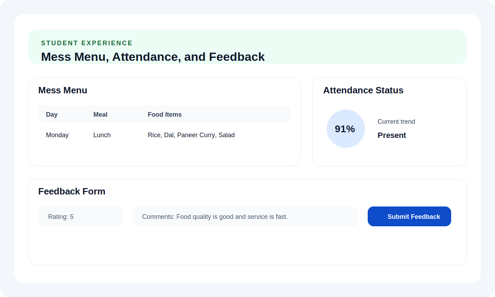

# SecureMeal

<p align="center">
  
</p>

<p align="center">
  <strong>A hostel mess management system with live admin workflows, DBMS-friendly schema design, and an interactive SQL lab mode.</strong>
</p>

<p align="center">
  
  
  
  
</p>

## Overview

SecureMeal is a full-stack hostel mess management system built for academic DBMS demonstration and practical web app showcase. It supports student and admin workflows, MySQL-backed APIs, demo fallback mode, and a Database Lab screen for live SQL demonstrations.

It is designed to be:

- easy to run locally
- clear enough for viva explanation
- strong enough to showcase tables, triggers, views, procedures, and analytics ideas

## Highlights

- Student registration with generated student ID
- Student and admin login flows
- Menu management, attendance marking, and feedback tracking
- Demo-ready backend fallback when MySQL is unavailable
- Admin-only Database Lab Mode for safe query execution
- Enterprise SQL blueprint with advanced schema, triggers, views, and procedures

## Screenshots

### Platform Overview



### Database Lab Mode



### Student Experience



## Tech Stack

| Layer | Stack |
| --- | --- |
| Frontend | React, Vite, Axios, React Router |
| Backend | Node.js, Express |
| Database | MySQL, `mysql2/promise` |
| Styling | Plain CSS |
| Demo Layer | In-memory fallback store |

## Core Modules

### Student Module

- register new students
- login with student ID
- view menu
- mark attendance
- submit feedback

### Admin Module

- add menu items
- inspect student attendance
- review feedback
- open Database Lab Mode

### Database Lab Mode

- run safe SQL queries
- inspect execution plans with `EXPLAIN`
- use prebuilt demo queries
- trigger procedure demos
- inspect recent query and trigger logs

## Project Structure

```text
SecureMeal/
├── backend/
│   ├── controllers/
│   ├── middleware/
│   ├── migrations/
│   ├── routes/
│   ├── scripts/
│   ├── sql/
│   ├── db.js
│   ├── demoStore.js
│   ├── schema.sql
│   └── server.js
├── docs/
│   └── screenshots/
├── frontend/
│   ├── src/
│   │   ├── components/
│   │   ├── pages/
│   │   ├── services/
│   │   └── styles.css
│   └── vite.config.js
└── README.md
```

## Quick Start

### 1. Start the backend

```bash
cd ./backend
npm install
node server.js
```

Backend:

```text
http://localhost:5000
```

### 2. Start the frontend

```bash
cd ./frontend
npm install
npm run dev
```

Frontend:

```text
http://localhost:5173
```

### 3. Open the app

- Student/Admin app: [http://localhost:5173](http://localhost:5173)
- Health check: [http://localhost:5000/api/health](http://localhost:5000/api/health)
- Database Lab Mode: [http://localhost:5173/lab](http://localhost:5173/lab)

## Environment Variables

Create `backend/.env` using:

```env
PORT=5000
DB_HOST=127.0.0.1
DB_USER=root
DB_PASSWORD=
DB_NAME=securemeal
DEMO_MODE=false
```

## Demo Login

Use these demo accounts from the login page:

- Student: `Aarav Sharma` with ID `101`
- Student: `Diya Patel` with ID `102`
- Student: `Rohan Verma` with ID `103`
- Admin: `Mess Admin`

## Database Lab Usage

After logging in as admin, open:

```text
http://localhost:5173/lab
```

Supported safe query types:

- `SELECT`
- `SHOW`
- `DESC`
- `EXPLAIN`
- approved `CALL`

Example queries:

```sql
SELECT s.student_id, s.name, s.dept, mp.plan_type
FROM STUDENT s
LEFT JOIN MESS_PLAN mp ON mp.student_id = s.student_id
ORDER BY s.student_id;
```

```sql
SELECT student_id, date_val, meal_type, status
FROM ATTENDANCE
ORDER BY date_val DESC;
```

```sql
EXPLAIN SELECT * FROM STUDENT;
```

## Enterprise SQL Blueprint

The advanced database showcase file is:

[`backend/sql/enterprise_blueprint.sql`](./backend/sql/enterprise_blueprint.sql)

Load it in MySQL:

```bash
mysql -u root -p
```

Then inside MySQL:

```sql
SOURCE ./backend/sql/enterprise_blueprint.sql;
```

This creates a separate showcase database:

```text
securemeal_enterprise
```

Useful commands:

```sql
USE securemeal_enterprise;
SHOW TABLES;
SHOW TRIGGERS;
SHOW FULL TABLES WHERE Table_type = 'VIEW';
SHOW PROCEDURE STATUS WHERE Db = 'securemeal_enterprise';
CALL revenue_breakdown();
CALL inventory_forecast();
CALL detect_irregular_attendance();
```

## Useful Development Commands

Check backend health:

```bash
curl http://localhost:5000/api/health
```

Check menu API:

```bash
curl http://localhost:5000/api/menu
```

Run migrations:

```bash
cd ./backend
npm run migrate
```

## GitHub Update Flow

Whenever you change the project:

```bash
cd .
git status
git add .
git commit -m "Describe your changes"
git push
```

## Notes

- The main working application uses the `securemeal` database.
- The advanced DBMS showcase SQL creates `securemeal_enterprise`.
- Demo fallback mode helps the project stay presentation-ready even if MySQL is temporarily unavailable.
